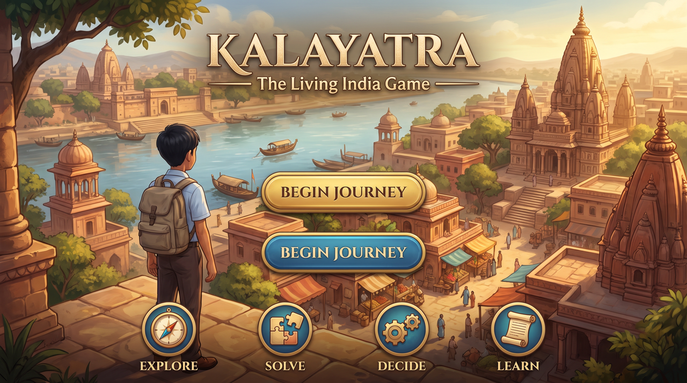
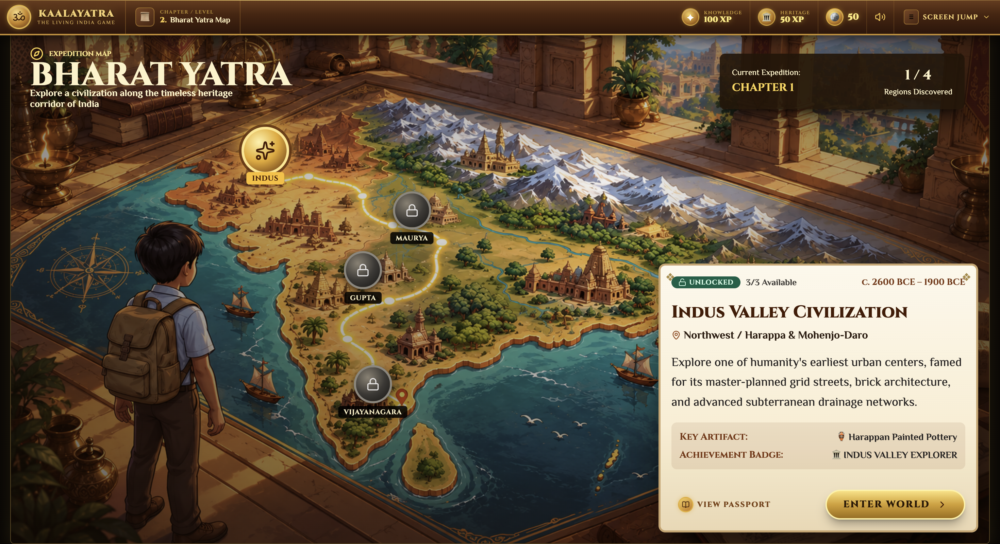

# KaalaYatra — The Living Indian Game

A game-based learning platform that teaches Indian history, geography, and culture through interactive storytelling, exploration, and decision-making.

---

## Screenshots

### World Exploration


### Bharat Yatra Map


---

## What is KaalaYatra?

KaalaYatra ("Journey Through Time") is a browser-based educational game built for students aged 10–16. Instead of reading textbooks, players explore ancient Indian civilizations as an interactive adventure — walking through historical cities, talking to NPCs, solving puzzles, and making decisions that change outcomes.

The game aligns with NEP 2020 and NCF 2023 curriculum goals, making humanities learning engaging and memorable.

---

## Core Modules

| Module | Description |
|---|---|
| **Bharat Yatra** | Geographical exploration of India's civilizations on an isometric map |
| **Kaal Darshan** | Time-period storylines across Indus Valley, Mauryan, Gupta, Chola, Mughal, and Independence eras |
| **Neeti Nirmaan** | Historical decision-making challenges with real consequences |
| **Virasat** | Artifact collection and heritage discovery system |
| **AI History Guide** | LLM-powered tutor that answers questions in context |
| **Bharat Passport** | Player journal tracking progress, artifacts, and achievements |

---

## Prototype — What's Built

This repository is the **interactive UI prototype** built with React + Vite. It covers the full game flow across 10 screens:

1. **Intro Screen** — Title screen with animated entry
2. **Bharat Yatra Map** — Isometric map of India with selectable civilization nodes
3. **World Explore** — Walkable isometric city with animated VED character (WASD / Arrow keys / D-Pad)
4. **Dialogue** — NPC conversation with the City Elder
5. **Learn** — Historical insight card (Urban Sanitation Blueprint)
6. **Drainage Puzzle** — Interactive channel-alignment puzzle
7. **Decision** — Historical choice screen with two options
8. **Consequence** — Before/after result screen
9. **Historical Insight** — Summary screen with discovered artifact
10. **Bharat Passport** — Player journal with chapter progress and locked eras

---

## Tech Stack

- **React 19** + **Vite 6**
- **Lucide React** for icons
- **Canvas Confetti** for celebration effects
- **CSS-in-JS** (inline styles + custom CSS) — no Tailwind dependency in production
- Sprite-based character animation via `requestAnimationFrame` and direct DOM mutation

---

## Getting Started

```bash
# Install dependencies
npm install

# Run development server
npm run dev
```

Open [http://localhost:5173](http://localhost:5173) in your browser.

---

## Controls (World Explore)

| Input | Action |
|---|---|
| `W` / `↑` | Move up |
| `S` / `↓` | Move down |
| `A` / `←` | Move left |
| `D` / `→` | Move right |
| `E` / `Space` | Talk to NPC |
| On-screen D-Pad | Mobile / touch movement |

---

## Project Structure

```
src/
├── components/
│   └── HeaderHUD.jsx        # Top navigation bar
├── screens/
│   ├── IntroScreen.jsx
│   ├── BharatMapScreen.jsx
│   ├── WorldExploreScreen.jsx
│   ├── DialogueScreen.jsx
│   ├── LearnScreen.jsx
│   ├── DrainagePuzzleScreen.jsx
│   ├── DecisionScreen.jsx
│   ├── ConsequenceScreen.jsx
│   ├── InsightScreen.jsx
│   └── PassportScreen.jsx
└── utils/
    └── SoundEngine.js
public/
└── assets/                  # All game images and sprite sheets
```

---

## Team

Built for **Smart India Hackathon (SIH)** — KaalaYatra submission.
